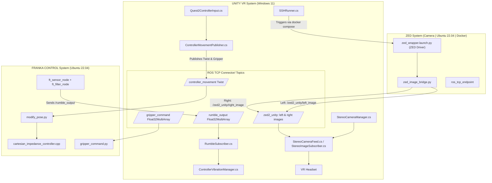

# 🤖 VR_Teleop_Interface

---

This repository provides a multi-branch architecture to integrate **Franka Emika Panda robot (including gripper and Botasys SenseONE Force-Torque Sensor)**, **ZED2 stereo camera**, and **VR Meta Quest 2** using **ROS2 Humble**, **Unity**, and **Docker**.

## 📚 Overview

This system enables:
- 6DOF Cartesian Impedance control of the Franka Research 3 robot
- Gripper control (Open and Grasping)
- Real-time stereo camera feed into Unity via ROS TCP
- Controllers Rumble, haptic feedbakc, from force-torque sensor readings
- SSH-triggered launch of all ROS infrastructure via Unity

---

## 🧠 Global Architecture



---

## 🌲 Branches

| Branch                  | Purpose                                                  |
|-------------------------|----------------------------------------------------------|
| `main`                 | Where you are right now, explanation of the project       |
| [`Aorus: zed_ros2_ws`](https://github.com/JuanR5/VR_Teleop_Interface/tree/aorus_zed)| Docker container incharge of ZED Camera deployment, zed_bridge, ROS TCP Endpoint|
| [`unity_vr`](https://github.com/JuanR5/VR_Teleop_Interface/tree/unity_vr)| Unity XR + ROS TCP Connector, Stereo Vizualization + controller handling |
| [`cubi: franka_control`](https://github.com/JuanR5/VR_Teleop_Interface/tree/cubi) | ROS2 Franka bringup, cartesian impedance controller, gripper control, ft_sensor, launch |

---

## 🗂️ Components

### 🎮 Unity
- [`StereoCameraManager`](https://github.com/JuanR5/VR_Teleop_Interface/blob/unity_vr/docs/cameraDiagram.md)
- [`ControllerPublisher`](https://github.com/JuanR5/VR_Teleop_Interface/blob/unity_vr/docs/controllerDiagram.md)
- [`SSHRunner`](https://github.com/JuanR5/VR_Teleop_Interface/blob/unity_vr/Assets/scripts/sshRunner.cs)

### 🧠 ROS2
- `zed_image_bridge.py` – republish ZED images
- `modify_pose.py` – VR-driven pose commands
- `ft_filter_node.cpp` – intensity → vibration
- `gripper_command.py` – triggers Franka gripper actions
- `cartesian_impedance_controller.cpp` – Cartesian torque control

---

## 🐳 Docker Setup (ZED PC)
```bash
docker pull juanr55/zed_rostcp:v5
docker-compose up -d
docker exec -it vr_zed_container bash
ros2 launch middle_nodes zed_vr_conexion.launch.py
```

---

## 🛠 Setup (Unity)
1. Clone Project and open it in Unity Editor
2. **Select** the appropriate **Scene** to work with (`SampleScene`).
This scene includes all the **elements** and **game objects** connected to the project's scripts.
3. **Check project settings**:
   - Ensure the **Robotics package**, **ROS2 plugin** is selected and the **ip** address of the _ROS_TCP_EndPoint PC_ is correct.
   - Go to **File → Build Settings**, and make sure the **Build Platform** is set to **Android**.
4. Start ROS PC or SSH auto-launch via `SSHRunner`
5. Play scene in VR

---

## 🤝 Credits

- [Franka ROS2](https://github.com/frankaemika/franka_ros2)
- [Base Cartesian Impedance Controller](https://github.com/sp-sophia-labs/franka_ros2)
- [Unity ROS TCP Connector](https://github.com/Unity-Technologies/ROS-TCP-Connector)
- [StereoLabs ZED ROS2 Wrapper](https://github.com/stereolabs/zed-ros2-wrapper)
- [ROS2-pkg-controller-create](https://github.com/jellehierck/ros2-pkg-create)
- [Nakama Robotics Laboratory, University of Twente](https://www.utwente.nl/en/et/be/research/nakama_robotics_lab/)
- [Robotics and Autonomous Systems Research Group, Universidad Autónoma de Occidente](https://github.com/RAS-UAO)
- [Robotics and Mechatronics, University of Twente](https://www.ram.eemcs.utwente.nl/)
---
