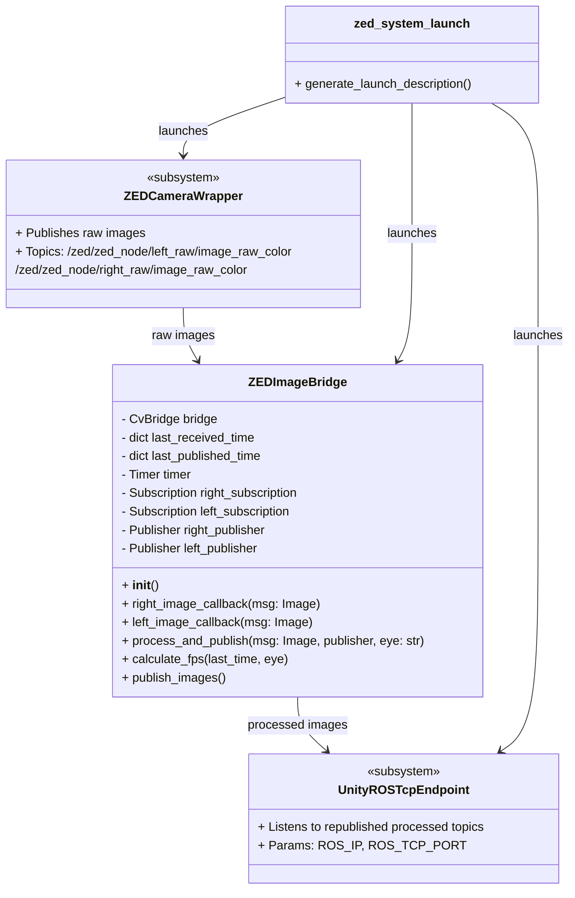

# ZED Dedicated Environment

For the ZED camera in this project a dedicated PC is used.

This container is based on the [StereoLabs Repository](https://github.com/stereolabs/zed-ros2-wrapper/tree/master/docker)

./desktop_build_dockerfile_from_sdk_ubuntu_and_cuda_version.sh ubuntu-22.04 cuda-12.1.0 zedsdk-4.2.0


**DON'T FORGET TO ENABLE GPU FOR DOCKER** 
### Enable gpu for docker: https://www.stereolabs.com/docs/docker/install-guide-linux#nvidia-docker
```bash
curl -fsSL https://nvidia.github.io/libnvidia-container/gpgkey | sudo gpg --dearmor -o /usr/share/keyrings/nvidia-container-toolkit-keyring.gpg \
curl -s -L https://nvidia.github.io/libnvidia-container/stable/deb/nvidia-container-toolkit.list | \
    sed 's#deb https://#deb [signed-by=/usr/share/keyrings/nvidia-container-toolkit-keyring.gpg] https://#g' | \
    sudo tee /etc/apt/sources.list.d/nvidia-container-toolkit.list

sudo apt-get update && sudo apt-get install -y nvidia-container-toolkit
sudo systemctl daemon-reload
sudo systemctl restart docker

sudo nano /etc/docker/daemon.json
```

Copy inside the file created:

```bash
{
    "runtimes": {
        "nvidia": {
            "path": "nvidia-container-runtime",
            "runtimeArgs": []
        }
    }
}
```

## Based on the previous you can use the following image:
```bash
docker pull juanr55/zed_rostcp:v5 
```

> Or to build the image from the DockerFile, run the following:
>```bash
>docker build -t zed_container:latest .
>```

### Start the container:
```bash
docker-compose up -d
```
Modify the docker compose, otherwise the following command is already running when you start the container.

### Attach to the container:
```bash
docker exec -it vr_zed_container bash
```

### Launch ROS2 inside the container:
```bash
ros2 launch middle_nodes zed_vr_conexion.launch.py ros_ip:=<ip_address>
```

### Diagram



---
# Acknowledgements

- [ROS TCP ENDPOINT](https://github.com/Unity-Technologies/ROS-TCP-Endpoint/tree/main-ros2?tab=readme-ov-file)
- [Stereo Labs - Zed ROS2 Wrapper](https://github.com/stereolabs/zed-ros2-wrapper)
