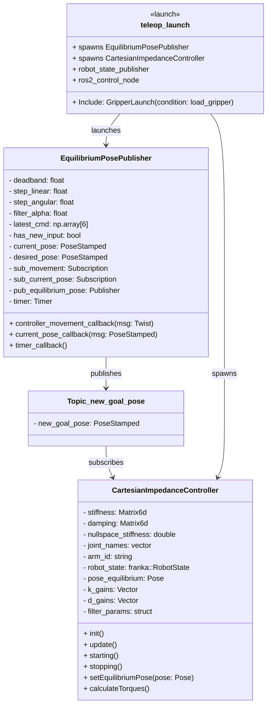
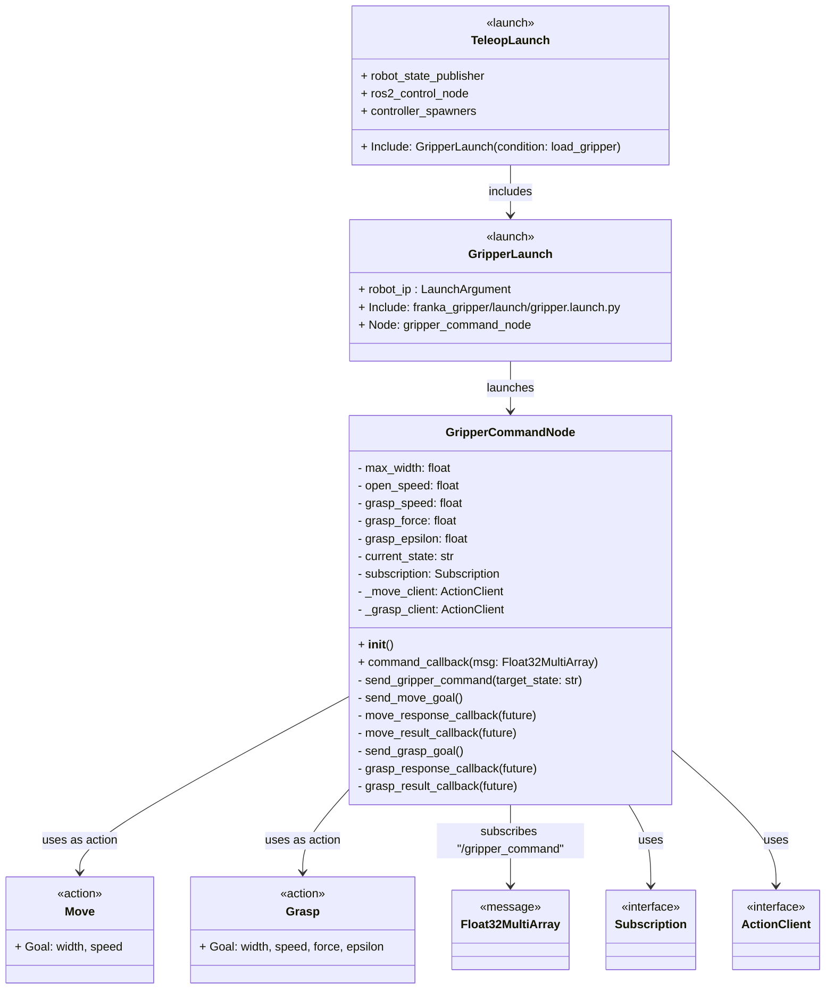
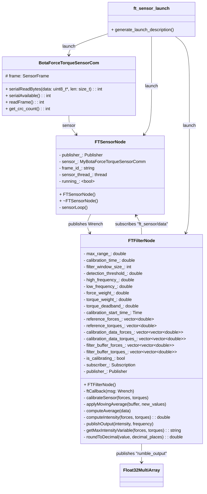

# ROS 2 Integration for Franka Robotics Research Robots

This repository contains the full ROS 2 workspace setup to interface with the **Franka Emika Research 3 robotic arm** for **teleoperation**. This setup is designed to work with ROS2 Humble and leverages the **Franka Control Interface (FCI)** for real-time control.

Another component of this integration is the use of the **SenseOne 6-axis force-torque sensor from Botasys**, mounted at the end effector of the robotic arm. The sensor data is utilized to enable haptic feedback teleoperation modes.

---

## Features

- ✅ Full ROS 2 integration with Franka Research 3 hardware via FCI
- 🧠 Real-time force/torque feedback using the SenseOne sensor from Botasys
- 🔄 Modular and extensible ROS2 node structure
- 🧪 Easily adaptable for research in haptics, human-robot interaction, and impedance control
- 📦 Includes example launch files and configuration for quick startup

---

## Project Structure

```
ros2_ws/
├── src/
│   ├── franka_ros2/             # Official ROS 2 interface to Franka Emika and all related packages
│   ├── franka_teleop_pkg/       # Custom teleoperation control nodes
|   ├── franka_teleop_pkg_interfaces/    #generated with the pkg generator
│   ├── ft_sensor_node/          # Botasys SenseOne sensor drivers and interfaces
│   ├── middle_nodes/            # Additional nodes for data processing, control and gripper
│   └── ros_tcp_endpoint/        # ROS 2 TCP endpoint for remote control
```

---

## Getting Started

### Prerequisites

- Franka Research 3 robotic arm
- Ubuntu 22.04, Real time kernel
- Docker

---

## Franka Research 3 Setup Instructions

Before proceeding, please ensure the following:

- You have completed the **Real-Time Kernel Configuration**.
- You have set up the **Franka Control Interface (FCI)** correctly.
- Your system meets the **minimum requirements for 1kHz control**.
- If you are using **Docker**, verify that:
  - All necessary permissions are granted.
  - CPU access settings are properly configured.
- Configure the CPU for maximum performance by disabling CPU frequency scaling.  
  See: [CPU Scaling Instructions](https://frankaemika.github.io/docs/troubleshooting.html#disabling-cpu-frequency-scaling).

### ROS 2 Workspace Build Notes

When building the ROS 2 workspace, follow these steps carefully:

1. Build the workspace with the correct optimization flags:
   ```bash
   colcon build --symlink-install --cmake-args -DCMAKE_BUILD_TYPE=Release
   ```

2. Be aware that **some packages must be built in a specific order** due to dependencies:
   - **First**, exclude `franka_teleop_pkg` and `franka_teleop_pkg_interfaces` using `--packages-skip`:
     ```bash
     colcon build --symlink-install --cmake-args -DCMAKE_BUILD_TYPE=Release --packages-skip franka_teleop_pkg franka_teleop_pkg_interfaces
     ```

3. After the initial build, **source** the workspace:
   ```bash
   source install/setup.bash
   ```

4. Finally, build the skipped packages separately:
   ```bash
   colcon build --symlink-install --cmake-args -DCMAKE_BUILD_TYPE=Release --packages-select franka_teleop_pkg_interfaces franka_teleop_pkg
   source install/setup.bash
   ```
---

## Running the System

### Launch Franka Robot with Teleoperation

```bash
ros2 launch franka_teleop_pkg teleop.launch.py
```

This launch file will:

- Connect to the Franka robot via FCI
- Start the teleoperation control node
- Launch the SenseOne FT sensor node for data publishing
- Activate the Gripper Control
- Optionally visualize the robot in RViz2

---

## SenseOne Force-Torque Sensor

The SenseOne sensor is mounted at the end effector and is used to capture real-time force and torque data. This data is published as a standard `geometry_msgs/WrenchStamped` message and is integrated into the control loop to enable: haptic feedback applications

---

## Teleoperation Capabilities

Teleoperation can be achieved using supported input devices such as:

- Meta Quest 2 Touch controllers
- Keyboard (limited functionality)

The control node maps device inputs to Cartesian commands.

---

## User testing

For Automated data collection a bash script is added wich will generate a rosbag with topics of interes, measure task execution, and allow to write down aditional notes for each task. `newTest.sh`

---

## Diagrams

### Franka Control Diagram



### Gripper Diagram



### Force-Torque Sensor Diagram



---

## License

All packages of `franka_ros2` are licensed under the [Apache 2.0 license](https://www.apache.org/licenses/LICENSE-2.0.html).

See the [Franka Control Interface (FCI) documentation](https://frankaemika.github.io/docs) for more detailed information about low-level control features and APIs.

---

## Acknowledgments

This project builds upon the excellent work from the following repositories and contributors:

- [frankaemika/franka_ros2](https://github.com/frankaemika/franka_ros2) – Official ROS 2 interface for the Franka Emika robot
- [botasys/SenseOne-ROS](https://gitlab.com/botasys/bota_serial_driver/-/tree/master?ref_type=heads) – C++ Driver for the SenseOne force-torque sensor
- [ros2-controller-package-create](https://github.com/jellehierck/ros2-pkg-create/tree/controllers-package) – Thanks to Jelle Hierck, for the automatic package generator with a franka controller template.
- [ROS-TCP-EndPoint](https://github.com/Unity-Technologies/ROS-TCP-Endpoint/tree/main-ros2)
- [Cartesian Impedance Controller](https://github.com/sp-sophia-labs/franka_ros2) – Implementation of Cartesian Impedance Controller for the Franka Emika Robot ROS2 
- The ROS 2 community and contributors for ongoing development of robust robotics middleware

Special thanks to the research community for their input and suggestions, and to all open-source contributors who make robotic development more accessible.

---
