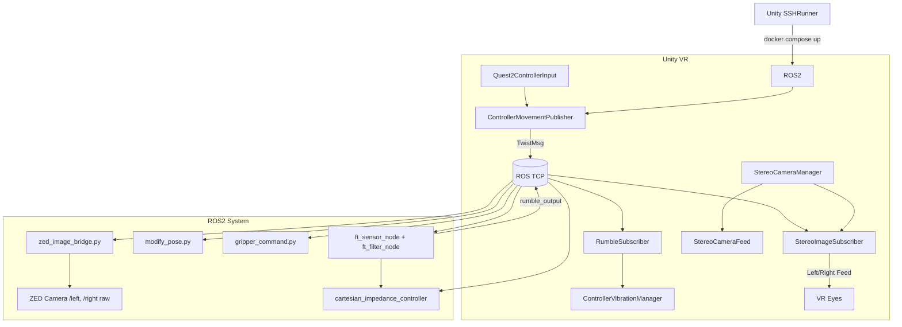

# 🤖 VR_Teleop_Interface

---

This repository provides a multi-branch architecture to integrate **Franka Emika Panda robot (including gripper and Botasys SenseONE)**, **ZED2 stereo camera**, and **VR Meta Quest 2** using **ROS2**, **Unity**, and **Docker**.

## 📚 Overview

This system enables:
- 6DOF Cartesian control of a real Franka Panda robot
- Gripper command publishing from VR
- Real-time stereo camera feed into Unity via ROS TCP
- Rumble haptics from force/torque sensor collisions
- SSH-triggered launch of all ROS infrastructure via Unity

---

## 🧠 Global Architecture



---

## 🌲 Branches

| Branch                  | Purpose                                                  |
|-------------------------|----------------------------------------------------------|
| `main`                 | WHere you are right now, explanation of the project                      |
| `Aorus: zed_ros2_ws`   | Docker container incharge of ZED Camera deployment, zed_bridge, launch   |
| `unity_vr`             | Unity XR + ROS connector, stereo + controller handling   |
| `cubi: franka_control` | ROS2 Franka bringup, cartesian impedance + gripper ctrl, ft_sensor, launch |

---

## 🗂️ Components

### 🎮 Unity
- `StereoCameraManager`(docs/unity_camera_arch.md)
- `ControllerPublisher`(docs/controller_integration.md)
- `RumbleSubscriber`(docs/controller_integration.md)
- [`SSHRunner`](docs/unity_camera_arch.md)

### 🧠 ROS2
- `zed_image_bridge.py` – republish ZED images
- `modify_pose.py` – VR-driven pose commands
- `ft_filter_node.cpp` – intensity → vibration
- `gripper_command.py` – triggers Franka gripper actions
- `cartesian_impedance_controller.cpp` – Cartesian torque control

---

## 🐳 Docker Setup (ZED PC)
```bash
docker pull juanr55/zed_rostcp:latest
docker-compose up -d
docker exec -it vr_zed_container bash
ros2 launch middle_nodes zed_vr_conexion.launch.py
```

---

## 🛠 Setup (Unity)
1. Open Unity project with Oculus SDK and ROS TCP Connector
2. Assign `StereoCameraManager` to scene root
3. Start ROS PC or SSH auto-launch via `SSHRunner`
4. Play scene in VR

---

## 📖 Related Docs

- 📄 [Franka Launch & Control](docs/cartesian_control.md)
- 🎥 [Camera Integration](docs/unity_camera_arch.md)
- 🎮 [Controller I/O](docs/controller_integration.md)
- 📦 [ZED Docker Setup](docs/zed_env.md)

---

## 🤝 Credits

- [Franka ROS2](https://github.com/frankaemika/franka_ros2)
- [Unity ROS TCP Connector](https://github.com/Unity-Technologies/ROS-TCP-Connector)
- [StereoLabs ZED ROS2 Wrapper](https://github.com/stereolabs/zed-ros2-wrapper)

---

## 🧪 Future Extensions

- 


---

- [Franka](https://github.com/JuanR5/VR_Teleop_Interface/tree/cubi)
- [Zed](https://github.com/JuanR5/VR_Teleop_Interface/tree/aorus_zed)
- [Unity](https://github.com/JuanR5/VR_Teleop_Interface/tree/unity_vr)
