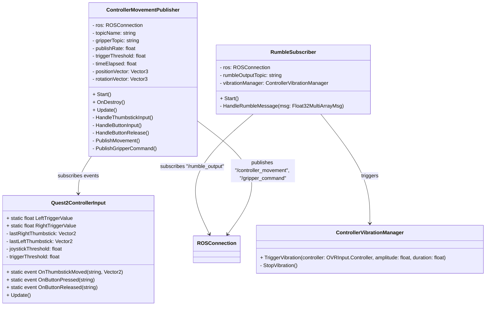
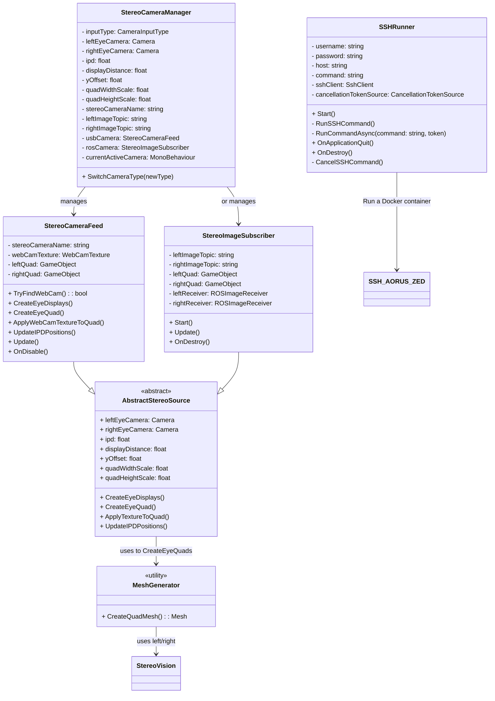

# VR Unity & ROSTCP Integration for Meta Quest 2  

This branch is dedicated to a **laptop running Unity Editor 3.10.0**, where the **Meta Quest 2 VR headset** is connected.  
The setup focuses on **visualization** and **joystick control commands** while using a **ROSTCP Connector** for communication.  

---

## Unity Configuration  

### Required Packages  

Add the following packages via Unity Package Manager using Git URLs:  

```txt
https://github.com/Unity-Technologies/ROS-TCP-Connector.git?path=/com.unity.robotics.ros-tcp-connector#v0.7.0

https://github.com/Unity-Technologies/ROS-TCP-Connector.git?path=/com.unity.robotics.visualizations#v0.7.0
```

### Additional Setup  

- Configure **Unity in the Robotics window** for **ROS2**.  
- Set the **IP address** of the receiver (computer running the ROS TCP Endpoint).  

---

## Initial Setup  

### 1. Duplicate the Mixed Reality (MR) Example  

- Start by duplicating the **Mixed Reality (MR) example project** in Unity.  
- Verify the following configurations:  
  - **Android subpage:** Set for **Oculus Quest 2**.  
  - **Stereo rendering mode:** Set to **Multi-Pass**.  
  - **OpenXR Feature Groups:**  
    1. Select **Meta Quest** and **Meta XR**.  
    2. Enable **Touch Controller Profile** in the interaction profiles.  
- Required packages:  
  - **Oculus Integration** (Deprecated)  
  - **OpenXR Plugin**  
- Use an **OVR Camera Rig** for the VR setup.  

---

## Unity Project Configuration  

### 1. Platform Settings  

- **Set build platform** to **Android**.  
- Configure the **OpenXR Plugin**:  
  - Install the **OpenXR Plugin** package.  
  - Enable **OpenXR as the XR runtime**.  
  - **Remove Oculus XR Plugin** to avoid conflicts.  

---

## Scene Configuration  

### 1. Basic Scene Elements  

- Add the following elements to your scene:  
  - **XR Origin** (for camera/HMD perspective).  
  - **World Space Canvas** (for UI elements).  
  - **Raw Image Component** (for video feed display).  

### 2. Canvas Setup  

- Set the **canvas render mode** to **World Space**.  
- Adjust scaling and positioning for visibility.  
- Ensure the canvas is **within the XR Origin** field of view.  

---

## Meta Quest Link Integration  

### 1. Connection Process  

1. Power on the **Meta Quest headset**.  
2. Enable **Quest Link**.  
3. Wait for the **white room environment** to load.  
4. **Do not** select any VR interface options.  

### 2. Unity Scene Execution  

1. Open the **Unity project**.  
2. Load the **configured scene**.  
3. Press **Play** in the **Unity Editor**.  
4. Verify the **display on both the PC and the VR headset**.  

---

## Video Feed Implementation  

### 1. Component Setup  

- Attach a **Raw Image component** to the **World Space Canvas**.  
- Position the **Raw Image** within the **XR Origin** field of view.  
- Configure appropriate **scaling for the video feed**.  

### 2. Script Configuration  

Use the following script to implement a **video feed using a webcam**:  

```csharp
using UnityEngine;
using UnityEngine.UI;

public class WebcamDisplay : MonoBehaviour
{
    public RawImage display;
    private WebCamTexture webcamTexture;

    void Start()
    {
        webcamTexture = new WebCamTexture();
        display.texture = webcamTexture;
        webcamTexture.Play();
    }
}
```
---

# Clonning repo and opening in Unity
> Faster way to set it up.
#### Steps:
1. **Clone the repository** from [GitHub](https://github.com/JuanR5/VR_Teleop_Interface/tree/unity_vr)

2. **Open Unity Hub**, click on **"Open"**, and select the **cloned project folder**.
3. Once Unity loads:
   - **Select** the appropriate **Scene** to work with (`SampleScene`).
   - This scene includes all the **elements** and **game objects** connected to the project's scripts.
4. **Check project settings**:
   - Ensure the **Robotics package**, **ROS2 plugin** is selected and the **ip** address of the _ROS_TCP_EndPoint PC_ is correct.
   - Go to **File → Build Settings**, and make sure the **Build Platform** is set to **Android**.
5. Test the project:
   - As before, already enabled the **Quest Link** inside the headset.
   - Press **Play** in Unity to run and visualize the stereo vision from the camera.

> ✅ *If set up correctly, you’ll see the scene in VR through your headset.*


---

## Important Notes  

### 1. Plugin Version Compatibility  

- **Avoid using the latest versions** of plugins.  
- Older versions **ensure stereo vision** for depth perception.  
- Newer versions **may handle this automatically and cause issues**.  

### 2. Meta Quest Link Configuration  

- **Proper configuration** allows the simulation to run **simultaneously on both the PC and the VR headset**.  
---

## Diagrams

### Controllers Comand reading and Rumble



### Camera Input and Stereo Vision


---
# Acknoledgements
- [Unity Robotics Hub](https://github.com/Unity-Technologies/Unity-Robotics-Hub)
- [Meta Quest 2](https://www.meta.com/nl/en/quest/products/quest-2/tech-specs/)
- [Meta Quest Link](https://www.meta.com/en-gb/help/quest/1517439565442928/)
- [Meta Quest Developer Hub](https://developers.meta.com/horizon/downloads/package/oculus-developer-hub-win/)
