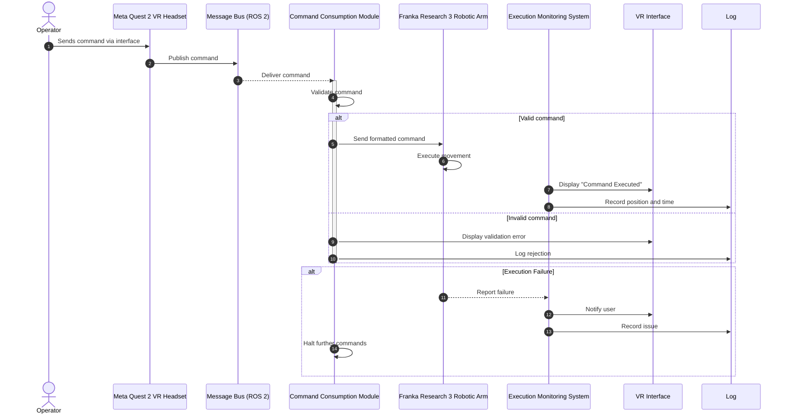

```mermaid
sequenceDiagram
    autonumber
    actor User as Operator
    participant VR as Meta Quest 2 VR Headset
    participant ROS as Message Bus (ROS 2)
    participant Consumer as Command Consumption Module
    participant Robot as Franka Research 3 Robotic Arm
    participant Monitor as Execution Monitoring System
    participant UI as VR Interface

    User ->> VR: Sends command via interface
    VR ->> ROS: Publish command

    ROS -->> Consumer: Deliver command
    activate Consumer
    Consumer ->> Consumer: Validate command
    alt Valid command
        Consumer ->> Robot: Send formatted command
        Robot ->> Robot: Execute movement
        Monitor ->> UI: Display "Command Executed"
        Monitor ->> Log: Record position and time
    else Invalid command
        Consumer ->> UI: Display validation error
        Consumer ->> Log: Log rejection
    end
    deactivate Consumer

    alt Execution Failure
        Robot -->> Monitor: Report failure
        Monitor ->> UI: Notify user
        Monitor ->> Log: Record issue
        Consumer ->> Consumer: Halt further commands
    end
```