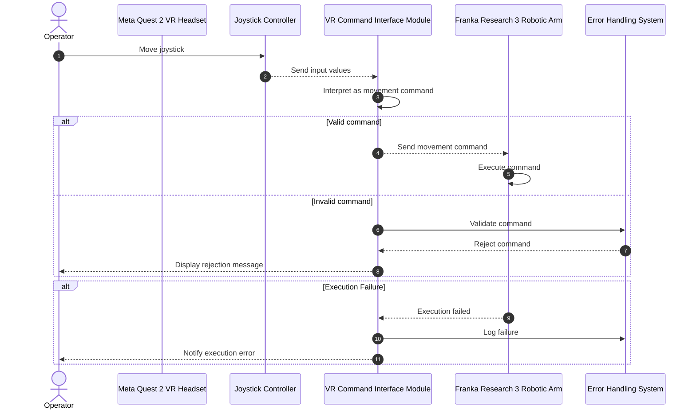

```mermaid
sequenceDiagram
    autonumber
    actor User as Operator
    participant VR as Meta Quest 2 VR Headset
    participant Joystick as Joystick Controller
    participant VRInterface as VR Command Interface Module
    participant Robot as Franka Research 3 Robotic Arm
    participant ErrorHandler as Error Handling System

    User ->> Joystick: Move joystick
    Joystick -->> VRInterface: Send input values
    VRInterface ->> VRInterface: Interpret as movement command

    alt Valid command
        VRInterface -->> Robot: Send movement command
        Robot ->> Robot: Execute command
    else Invalid command
        VRInterface ->> ErrorHandler: Validate command
        ErrorHandler -->> VRInterface: Reject command
        VRInterface -->> User: Display rejection message
    end

    alt Execution Failure
        Robot -->> VRInterface: Execution failed
        VRInterface ->> ErrorHandler: Log failure
        VRInterface -->> User: Notify execution error
    end
```