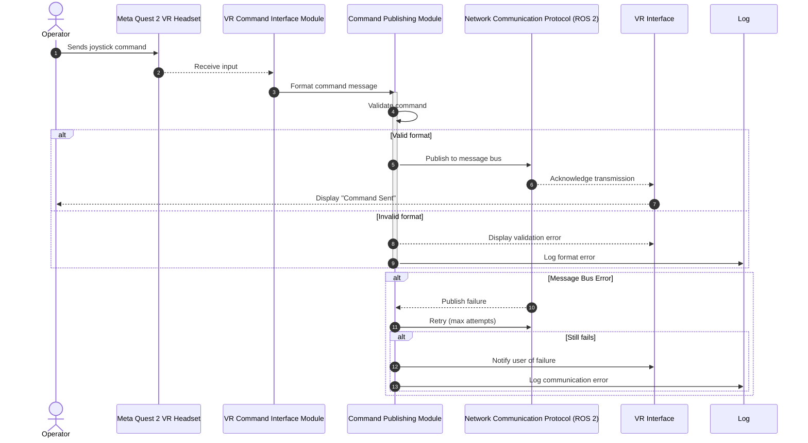

```mermaid
sequenceDiagram
    autonumber
    actor User as Operator
    participant VR as Meta Quest 2 VR Headset
    participant VRInterface as VR Command Interface Module
    participant Publisher as Command Publishing Module
    participant ROS as Network Communication Protocol (ROS 2)
    participant UI as VR Interface

    User ->> VR: Sends joystick command
    VR -->> VRInterface: Receive input
    VRInterface ->> Publisher: Format command message

    activate Publisher
    Publisher ->> Publisher: Validate command
    alt Valid format
        Publisher ->> ROS: Publish to message bus
        ROS -->> UI: Acknowledge transmission
        UI -->> User: Display "Command Sent"
    else Invalid format
        Publisher -->> UI: Display validation error
        Publisher ->> Log: Log format error
    end
    deactivate Publisher

    alt Message Bus Error
        ROS -->> Publisher: Publish failure
        Publisher ->> ROS: Retry (max attempts)
        alt Still fails
            Publisher ->> UI: Notify user of failure
            Publisher ->> Log: Log communication error
        end
    end
```