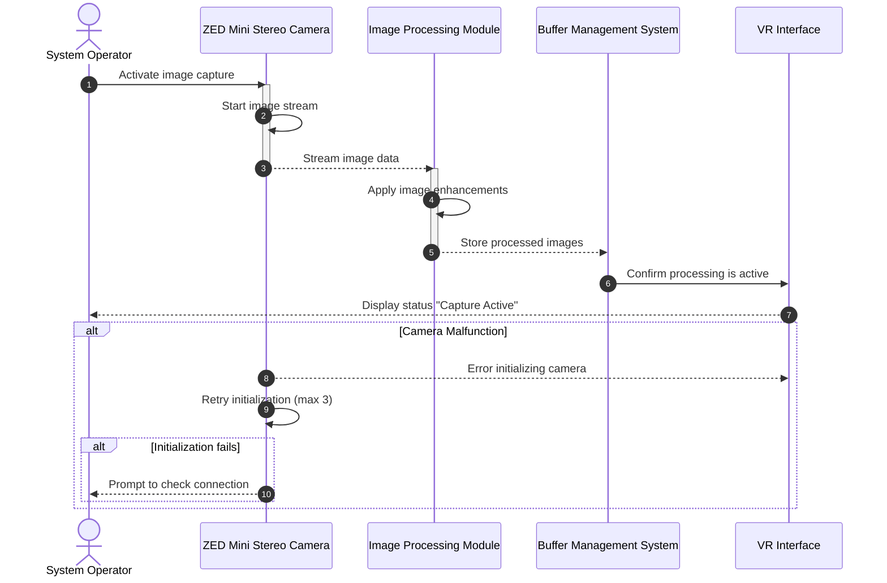

```mermaid
sequenceDiagram
    autonumber
    actor User as System Operator
    participant ZED as ZED Mini Stereo Camera
    participant Processor as Image Processing Module
    participant Buffer as Buffer Management System
    participant UI as VR Interface

    User ->> ZED: Activate image capture
    activate ZED
    ZED ->> ZED: Start image stream
    ZED -->> Processor: Stream image data
    deactivate ZED

    activate Processor
    Processor ->> Processor: Apply image enhancements
    Processor -->> Buffer: Store processed images
    deactivate Processor

    Buffer ->> UI: Confirm processing is active
    UI -->> User: Display status "Capture Active"

    alt Camera Malfunction
        ZED -->> UI: Error initializing camera
        ZED ->> ZED: Retry initialization (max 3)
        alt Initialization fails
            ZED -->> User: Prompt to check connection
        end
    end
```