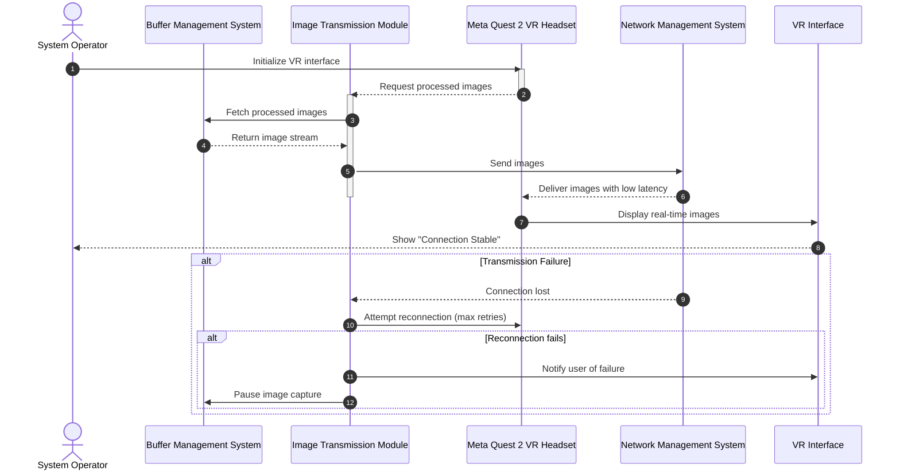

```mermaid
sequenceDiagram
    autonumber
    actor User as System Operator
    participant Buffer as Buffer Management System
    participant Transmitter as Image Transmission Module
    participant VR as Meta Quest 2 VR Headset
    participant Network as Network Management System
    participant UI as VR Interface

    User ->> VR: Initialize VR interface
    activate VR
    VR -->> Transmitter: Request processed images
    deactivate VR

    activate Transmitter
    Transmitter ->> Buffer: Fetch processed images
    Buffer -->> Transmitter: Return image stream
    Transmitter ->> Network: Send images
    Network -->> VR: Deliver images with low latency
    deactivate Transmitter

    VR ->> UI: Display real-time images
    UI -->> User: Show "Connection Stable"

    alt Transmission Failure
        Network -->> Transmitter: Connection lost
        Transmitter ->> VR: Attempt reconnection (max retries)
        alt Reconnection fails
            Transmitter ->> UI: Notify user of failure
            Transmitter ->> Buffer: Pause image capture
        end
    end
```