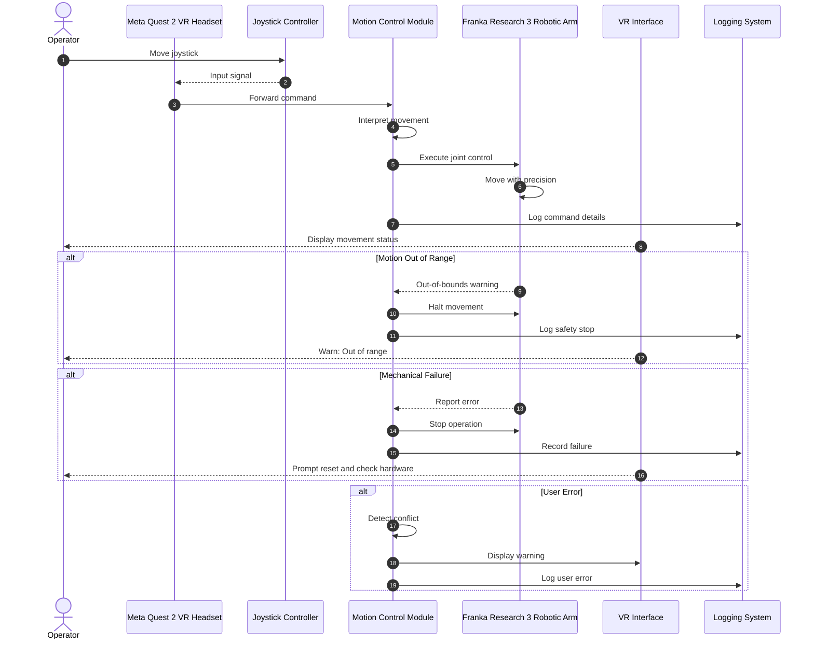

```mermaid
sequenceDiagram
    autonumber
    actor User as Operator
    participant VR as Meta Quest 2 VR Headset
    participant Joystick as Joystick Controller
    participant MotionCtrl as Motion Control Module
    participant Robot as Franka Research 3 Robotic Arm
    participant UI as VR Interface
    participant Log as Logging System

    User ->> Joystick: Move joystick
    Joystick -->> VR: Input signal
    VR ->> MotionCtrl: Forward command

    MotionCtrl ->> MotionCtrl: Interpret movement
    MotionCtrl ->> Robot: Execute joint control

    Robot ->> Robot: Move with precision
    MotionCtrl ->> Log: Log command details
    UI -->> User: Display movement status

    alt Motion Out of Range
        Robot -->> MotionCtrl: Out-of-bounds warning
        MotionCtrl ->> Robot: Halt movement
        MotionCtrl ->> Log: Log safety stop
        UI -->> User: Warn: Out of range
    end

    alt Mechanical Failure
        Robot -->> MotionCtrl: Report error
        MotionCtrl ->> Robot: Stop operation
        MotionCtrl ->> Log: Record failure
        UI -->> User: Prompt reset and check hardware
    end

    alt User Error
        MotionCtrl ->> MotionCtrl: Detect conflict
        MotionCtrl ->> UI: Display warning
        MotionCtrl ->> Log: Log user error
    end
```