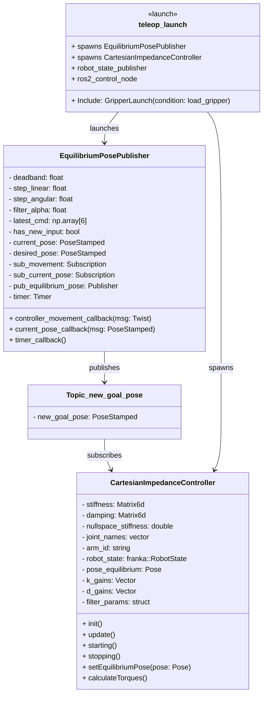

```mermaid
classDiagram
direction TB
class EquilibriumPosePublisher {
    - deadband: float
    - step_linear: float
    - step_angular: float
    - filter_alpha: float
    - latest_cmd: np.array[6]
    - has_new_input: bool
    - current_pose: PoseStamped
    - desired_pose: PoseStamped
    - sub_movement: Subscription<Twist>
    - sub_current_pose: Subscription<PoseStamped>
    - pub_equilibrium_pose: Publisher<PoseStamped>
    - timer: Timer
    + controller_movement_callback(msg: Twist)
    + current_pose_callback(msg: PoseStamped)
    + timer_callback()
}
class CartesianImpedanceController {
    - stiffness: Matrix6d
    - damping: Matrix6d
    - nullspace_stiffness: double
    - joint_names: vector<string>
    - arm_id: string
    - robot_state: franka::RobotState
    - pose_equilibrium: Pose
    - k_gains: Vector
    - d_gains: Vector
    - filter_params: struct
    + init()
    + update()
    + starting()
    + stopping()
    + setEquilibriumPose(pose: Pose)
    + calculateTorques()
}
class teleop_launch {
    <<launch>>
    + spawns EquilibriumPosePublisher
    + spawns CartesianImpedanceController
    + Include: GripperLaunch (condition: load_gripper)
    + robot_state_publisher
    + ros2_control_node
}
class Topic_new_goal_pose {
    - new_goal_pose: PoseStamped
}
EquilibriumPosePublisher --> Topic_new_goal_pose : publishes
Topic_new_goal_pose --> CartesianImpedanceController : subscribes
teleop_launch --> EquilibriumPosePublisher : launches
teleop_launch --> CartesianImpedanceController : spawns
```