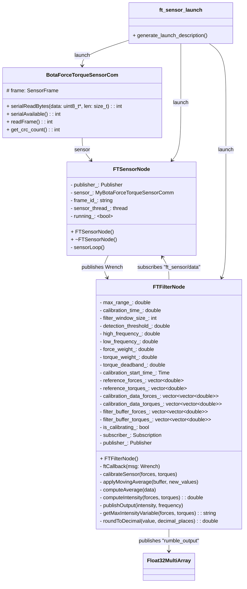

```mermaid
classDiagram
    direction TB
    class FTSensorNode {
        - publisher_: Publisher<Wrench>
        - sensor_: MyBotaForceTorqueSensorComm
        - frame_id_: string
        - sensor_thread_: thread
        - running_: ~bool~
        + FTSensorNode()
        + ~FTSensorNode()
        - sensorLoop()
    }

    class BotaForceTorqueSensorCom {
        + serialReadBytes(data: uint8_t*, len: size_t): int
        + serialAvailable(): int
        + readFrame(): int
        + get_crc_count(): int
        # frame: SensorFrame
    }

    class FTFilterNode {
        - max_range_: double
        - calibration_time_: double
        - filter_window_size_: int
        - detection_threshold_: double
        - high_frequency_: double
        - low_frequency_: double
        - force_weight_: double
        - torque_weight_: double
        - torque_deadband_: double
        - calibration_start_time_: Time
        - reference_forces_: vector~double~
        - reference_torques_: vector~double~
        - calibration_data_forces_: vector~vector~double~~
        - calibration_data_torques_: vector~vector~double~~
        - filter_buffer_forces_: vector~vector~double~~
        - filter_buffer_torques_: vector~vector~double~~
        - is_calibrating_: bool
        - subscriber_: Subscription<Wrench>
        - publisher_: Publisher<Float32MultiArray>
        + FTFilterNode()
        - ftCallback(msg: Wrench)
        - calibrateSensor(forces, torques)
        - applyMovingAverage(buffer, new_values)
        - computeAverage(data)
        - computeIntensity(forces, torques): double
        - publishOutput(intensity, frequency)
        - getMaxIntensityVariable(forces, torques): string
        - roundToDecimal(value, decimal_places): double
    }
    class Float32MultiArray
    class ft_sensor_launch {
        + generate_launch_description()
    }
    FTSensorNode --> FTFilterNode : publishes Wrench
    FTFilterNode --> FTSensorNode : subscribes "ft_sensor/data"
    FTFilterNode --> Float32MultiArray : publishes "rumble_output"
    ft_sensor_launch --> BotaForceTorqueSensorCom : launch
    ft_sensor_launch --> FTSensorNode : launch
    ft_sensor_launch --> FTFilterNode : launch
    BotaForceTorqueSensorCom --> FTSensorNode : sensor
```
