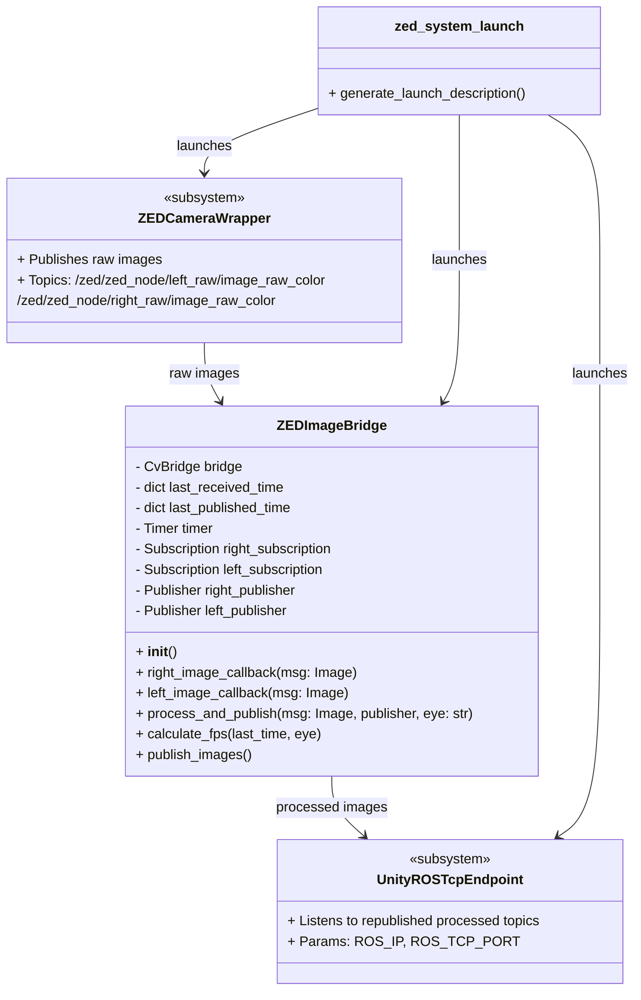

```mermaid
classDiagram
direction TB
    class ZEDImageBridge {
	    - CvBridge bridge
	    - dict last_received_time
	    - dict last_published_time
	    - Timer timer
	    - Subscription right_subscription
	    - Subscription left_subscription
	    - Publisher right_publisher
	    - Publisher left_publisher
	    + __init__()
	    + right_image_callback(msg: Image)
	    + left_image_callback(msg: Image)
	    + process_and_publish(msg: Image, publisher, eye: str)
	    + calculate_fps(last_time, eye)
	    + publish_images()
    }
    class ZEDCameraWrapper {
	    + Publishes raw images
	    + Topics: /zed/zed_node/left_raw/image_raw_color
	    /zed/zed_node/right_raw/image_raw_color
    }
    class UnityROSTcpEndpoint {
	    + Listens to republished processed topics
	    + Params: ROS_IP, ROS_TCP_PORT
    }
    class zed_system_launch {
	    + generate_launch_description()
    }

	<<subsystem>> ZEDCameraWrapper
	<<subsystem>> UnityROSTcpEndpoint

    ZEDCameraWrapper --> ZEDImageBridge : raw images
    ZEDImageBridge --> UnityROSTcpEndpoint : processed images
    zed_system_launch --> ZEDCameraWrapper : launches
    zed_system_launch --> ZEDImageBridge : launches
    zed_system_launch --> UnityROSTcpEndpoint : launches
```