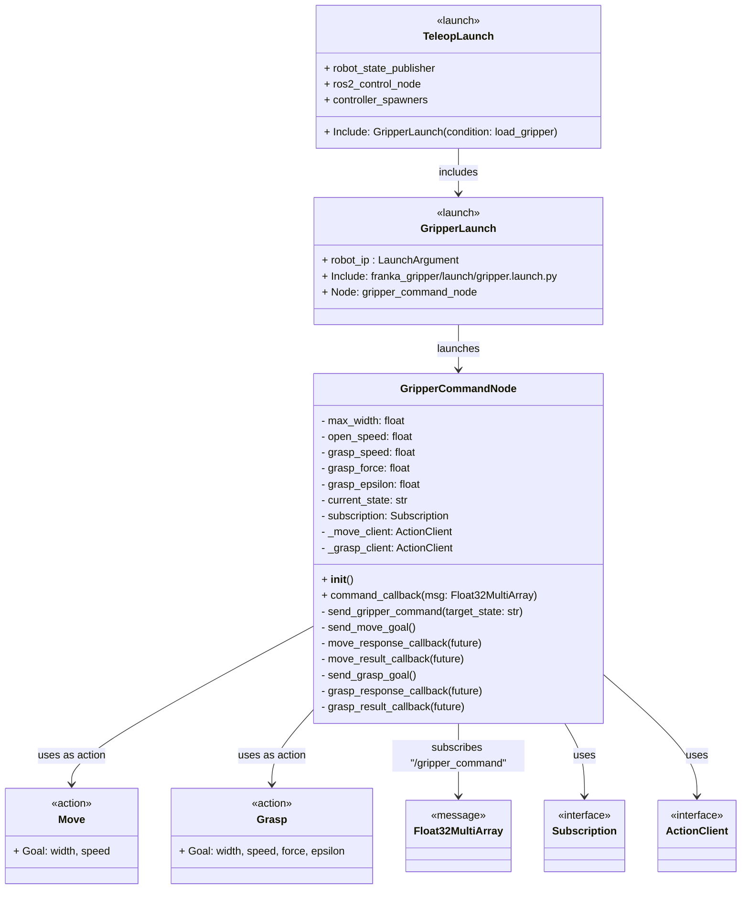

```mermaid
classDiagram
direction TB
class GripperCommandNode {
    - max_width: float
    - open_speed: float
    - grasp_speed: float
    - grasp_force: float
    - grasp_epsilon: float
    - current_state: str
    - subscription: Subscription
    - _move_client: ActionClient
    - _grasp_client: ActionClient
    + __init__()
    + command_callback(msg: Float32MultiArray)
    - send_gripper_command(target_state: str)
    - send_move_goal()
    - move_response_callback(future)
    - move_result_callback(future)
    - send_grasp_goal()
    - grasp_response_callback(future)
    - grasp_result_callback(future)
}
class Move {
    <<action>>
    + Goal: width, speed
}
class Grasp {
    <<action>>
    + Goal: width, speed, force, epsilon
}
class Float32MultiArray {
    <<message>>
}
class Subscription {
    <<interface>>
}
class ActionClient {
    <<interface>>
}
GripperCommandNode --> Move : uses as action
GripperCommandNode --> Grasp : uses as action
GripperCommandNode --> Float32MultiArray : subscribes "/gripper_command"
GripperCommandNode --> Subscription : uses
GripperCommandNode --> ActionClient : uses
class GripperLaunch {
    <<launch>>
    + robot_ip : LaunchArgument
    + Include: franka_gripper/launch/gripper.launch.py
    + Node: gripper_command_node
}
class TeleopLaunch {
    <<launch>>
    + Include: GripperLaunch (condition: load_gripper)
    + robot_state_publisher
    + ros2_control_node
    + controller_spawners
}
TeleopLaunch --> GripperLaunch : includes
GripperLaunch --> GripperCommandNode : launches
```